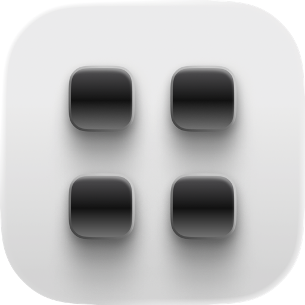
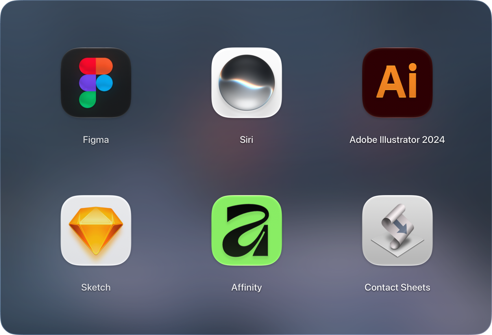
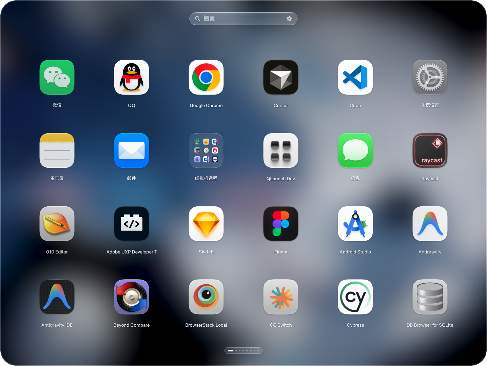

# 🚀 QLaunch

<div align="center">
  
</div>

<p align="center">
  简单、高性能的 macOS Launchpad 替代方案。设计师级别图标高质量渲染、120Hz 高帧率、 液态玻璃、过渡动画。
</p>

- 主页：[https://qzrzz.github.io/QLaunch/](https://qzrzz.github.io/QLaunch/)
- 下载：[https://github.com/qzrzz/QLaunch/releases](https://github.com/qzrzz/QLaunch/releases)

<div align="center">
  <video src="web/src/assets/v1.mp4" poster="web/src/assets/v1-p.png" autoplay loop muted playsinline width="100%"></video>
  <br>
</div>

<table>
  <tr>
    <td></td>
    <td></td>
  </tr>
</table>

## 作者的话

我很喜欢 Launchpad 满屏图标的感觉，macOS 遗弃 Launchpad 后我
就在寻找替代品，但试过一圈，始终没有找到真正满意的。

有些做得比较粗糙，有些塞进了太多功能，反而连 Launchpad 最基础的体验都没有做好。比如 LaunchNext 用起来太卡，LaunchOS 功能很丰富，但偶尔也会莫名卡顿，而且图标显示不够清晰。

所以我决定做一个流畅、图标显示清晰的 Launchpad ，功能要简单，效果要好。

这就是 QLaunch

## 特性

- Metal 渲染
- 图标高画质显示
- 过渡动画
- 拼音搜索

## 性能

QLaunch 追求设计师级别的最高画质图标显示效果和流畅的操作响应性，
Display P3 16bit 的高精度图标也可以完美显示，
不过考虑到普通用户的心声：“好像差别也不大啊” ，
画质优化会占用 3 倍以上的内存，我们提供了性能优先模式，和低内存占用模式。

-

| 模式     | 😍 画质优先       | 😀 性能优先     | 🙂 低内存占用   |
| -------- | ----------------- | --------------- | --------------- |
| 图标纹理 | float16 4× 超采样 | RGBA8 2× 超采样 | RGBA8 2× 超采样 |
| 屏幕缓冲 | float16 ×3        | bgra8Unorm ×3   | bgra8Unorm ×2   |
| 文字图集 | 2048px float16    | 2048px RGBA8    | RGBA8           |
| 驻留     | 全部页            | 全部页          | 当前页 ±1       |

## 构建与开发

需要 Xcode、macOS 14+ SDK 与 Bun：

```sh
bun install
bun run dev               # 构建 Debug .app 并前台运行
bun run debug             # 构建 Debug .app 并用 Instruments 打开
bun run debug -- --record # 同上，并用 xctrace Time Profiler 直接录制
bun run build             # 构建 Release .app、DMG、ZIP（不发布）
bun run release           # 签名、公证并发布 GitHub Release
bun run clean             # 清理构建产物
bun run check             # 检查 Swift Package 结构
bun run layout:export     # 导出当前网格顺序 / 文件夹 / 隐藏列表为 JSON
bun run layout:import     # 导入布局 JSON（默认 merge；请先手动加 --dry-run --strict）
bun run layout:validate   # 校验布局 JSON（不扫描磁盘）
```

### 架构

```
AppDelegate          NSPanel 生命周期、热键、状态栏、fade 展示
LaunchpadContainer   背景 + Metal 网格 + SwiftUI 覆盖层
DesktopBackground    CIGaussianBlur 壁纸
LaunchpadMetalView   图标 / 标签实例化绘制、DisplayLink 动画、翻页
AppStore             扫描结果、搜索、分页状态机、展示状态
```

### 官网

产品官网在 `web/`，架构与 QCopy/web 一致（Vite + React + TypeScript，多语言 SEO，构建同步到 `docs/` 供 GitHub Pages）。

```sh
cd web
bun install
bun run dev               # 本地预览
bun run build             # 打包并同步到 ../docs（en + zh-Hans）
```

详见 [web/README.md](web/README.md)。
